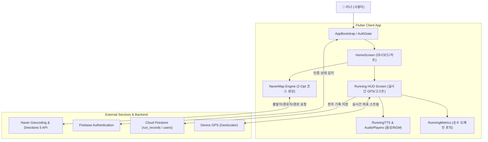
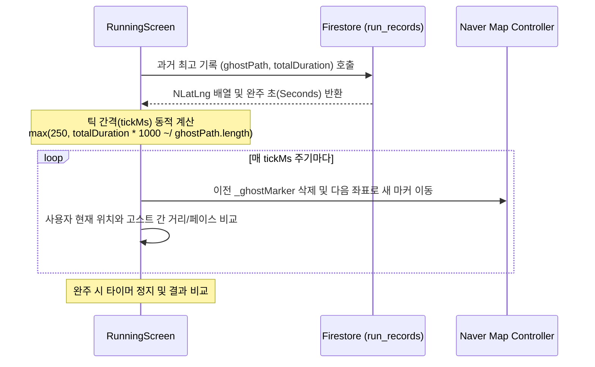

# [Flutter] 초보 러너를 위한 지능형 러닝 메이트 개발기: 2-Opt 경로 최적화부터 고스트 러너까지

> **부제**: 논문 기반의 실시간 러닝 보조 시스템 구현과 `setState` 모놀리스에서 클린 아키텍처로의 여정  
> **작성자**: 김민혁 (RunningMate 팀장)  
> **GitHub**: [https://github.com/min1336/RunningMate](https://github.com/min1336/RunningMate)

---

## 01. 시작하며: "러닝 열풍, 그런데 왜 초보 러너는 3일 만에 포기할까?"

2024~2025년 대한민국은 그야말로 **'러닝 크루' 열풍**이었습니다. 퇴근 후 한강이나 공원을 달리는 러너들이 급증했고, 저 역시 그 대열에 합류했습니다. 하지만 초보 러너로서 기존의 유명 러닝 앱(Nike Run Club, Strava 등)을 직접 사용하면서 몇 가지 분명한 장벽을 마주하게 되었습니다.

1. **초반 오버페이스와 부상 위험**: 초보자는 자신의 체력에 맞는 페이스를 유지하기 어렵습니다. 초반에 너무 빨리 달리다 지치거나 부상을 입고 중도 포기하게 됩니다.
2. **지루함과 새로운 코스 탐색의 부재**: 매번 집 앞 똑같은 트랙만 돌다 보면 금세 싫증이 납니다. 하지만 낯선 동네에서 안전하고 달리기 좋은 3km, 5km 순환 코스를 직접 설계하기는 매우 번거롭습니다.
3. **혼자 달릴 때의 동기부여 결여**: 크루에 나가지 않고 혼자 뛸 때도 마치 러닝 메이트가 옆에서 함께 달려주는 듯한 동기부여가 절실했습니다.

> *"초보자도 게임처럼 즐기며, 안전하고 꾸준하게 달릴 수 있는 러닝 플랫폼을 직접 만들자!"*

이 질문에서 대학 졸업작품이자 포트폴리오 프로젝트인 **RunningMate (런닝메이트)**가 출발했습니다. 단순한 클론 코딩을 넘어, **컴퓨터공학 알고리즘(2-Opt 휴리스틱)**과 **스포츠 음향학 논문**을 기반으로 실제 문제를 기술로 해결해 나간 과정을 공유합니다.

---

## 02. 전체 시스템 아키텍처 한눈에 보기

RunningMate는 모바일 크로스 플랫폼 환경에서 실시간 GPS 위치 스트림을 처리하고, 지도 렌더링 및 음성 피드백, 클라우드 저장을 동시에 수행합니다.



### 기술 스택 선정 이유

| 영역 | 기술 스택 | 선정 이유 |
| :--- | :--- | :--- |
| **프레임워크** | **Flutter (Dart 3.x)** | 단일 코드베이스로 iOS와 Android에서 고성능 네이티브 UI를 구현하고, 풍부한 지도/사운드 플러그인 생태계 활용 |
| **지도 SDK** | **Naver Map Flutter SDK** | 한국 지형, 보행로, 산책로 데이터가 가장 정확하며 세밀한 폴리라인 오버레이(`NPathOverlay`) 제공 |
| **백엔드** | **Firebase (Auth, Firestore)** | 서버리스 아키텍처를 채택하여 러닝 세션 데이터(`run_records`) 및 사용자 프로필, 랭킹을 실시간 NoSQL로 유연하게 저장 |
| **위치 & 오디오** | **Geolocator & audioplayers** | 배터리 효율과 정확도를 고려한 GPS 위치 스트리밍 및 상황별 동적 BGM/음성 안내 구현 |

---

## 03. Deep Dive 1: AI 동적 코스 추천과 2-Opt 휴리스틱 최적화

초보 러너에게 "오늘 3km를 뛰어보세요"라고만 하면 어디로 뛰어야 할지 막막합니다. RunningMate는 **출발지 주소와 목표 난이도(초급/중급/상급)만 입력하면 자동으로 안전한 순환 코스를 생성**합니다.

### 왜 단순 원형(Circle)이나 완전 무작위(Random)는 실패하는가?
초기에 단순 반경 내 임의의 좌표들을 뽑아 연결했을 때, 두 가지 치명적인 문제가 발생했습니다:
1. **경로 교차(Twisting)**: 경로 선이 리본처럼 꼬이면서 총 이동 거리가 불필요하게 늘어나고 러너가 길을 잃음.
2. **차량 전용도로 진입**: 무작위 도로를 이으면 사람이 달릴 수 없는 고속화도로나 위험한 차도가 포함됨.

이를 해결하기 위해 **순환 외판원 문제(Traveling Salesperson Problem, TSP)**에서 검증된 **2-Opt 휴리스틱 알고리즘**을 모바일 환경에 최적화하여 4단계 파이프라인을 구축했습니다.


### 2-Opt 최적화 알고리즘의 핵심 원리
* **참고 문헌**: *Corberán et al. (2012) "Exploring Variants of 2-Opt and 3-Opt for the General Routing Problem"*.
* 임의로 생성된 3개의 가상 경유지와 출발지/도착지 사이의 모든 간선을 검사하여, 두 간선 $(i, i+1)$과 $(j, j+1)$이 교차할 때 **경유지 순서를 뒤집어(sublist reverse) 총 거리가 단축되는지 확인**합니다. 더 이상 거리가 줄어들지 않을 때까지 반복합니다.

```dart
// lib/naver.dart 내 2-Opt 알고리즘 구현부
List<int> bestOrder = List.generate(waypoints.length, (index) => index);
double bestDistance = _calculateTotalDistance(waypoints, bestOrder);
bool improved = true;

while (improved) {
  improved = false;
  for (int i = 1; i < waypoints.length - 1; i++) {
    for (int j = i + 1; j < waypoints.length; j++) {
      // 새로운 순서 생성: i부터 j까지의 경유지 방문 순서를 뒤집음
      List<int> newOrder = List.from(bestOrder);
      newOrder.setRange(i, j + 1, bestOrder.sublist(i, j + 1).reversed);

      double newDistance = _calculateTotalDistance(waypoints, newOrder);
      if (newDistance < bestDistance) {
        bestDistance = newDistance;
        bestOrder = newOrder;
        improved = true; // 개선이 발생했으므로 루프 계속 수행
      }
    }
  }
}
```

최적화된 순서가 확정되면 Naver Directions 5 API 호출 시 **`traavoidcaronly` (자동차 전용도로 회피)** 옵션을 적용합니다. 그 결과, 사람이 안전하게 달릴 수 있는 인도와 공원 산책로 중심의 깔끔한 루프(Loop) 경로를 화면에 그려낼 수 있었습니다.

---

## 04. Deep Dive 2: 과거의 나와 경쟁하는 '고스트 러너(Ghost Runner)'

혼자 달릴 때 가장 강력한 동기부여는 **"어제의 나보다 조금 더 빠르게 완주하는 것"**입니다. 게임 카트라이더의 '타임어택 고스트'에서 영감을 얻어, **실시간 지도 위에 과거 기록(또는 친구 기록)의 페이스를 가진 가상 주자를 띄워 실시간으로 경주**하는 고스트 러너 기능을 구현했습니다.



### 시차를 극복하는 Time-slicing 알고리즘
과거 기록의 GPS 샘플 수가 몇 개이든 상관없이, 전체 완주 소요 시간을 균등하게 쪼개어 타이머 주기를 동적으로 산출했습니다.

```dart
// lib/running_screen.dart: 고스트 러너 실행 로직
void _startGhostRunner(List<NLatLng> ghostPath, int totalTimeInSeconds) {
  if (ghostPath.isEmpty || totalTimeInSeconds <= 0) return;

  var ghostIndex = 0;
  // 좌표 수에 따른 1포인트당 통과 평균 시간(ms) 계산 (최소 250ms 보장)
  final tickMs = max(250, totalTimeInSeconds * 1000 ~/ ghostPath.length);

  _ghostTimer?.cancel();
  _ghostTimer = Timer.periodic(Duration(milliseconds: tickMs), (timer) async {
    if (ghostIndex >= ghostPath.length) {
      timer.cancel();
      return;
    }

    final position = ghostPath[ghostIndex];
    if (_ghostMarker != null) {
      _mapController?.deleteOverlay(_ghostMarker!.info);
    }

    // 파란색 가상 주자 아이콘으로 지도상 위치 업데이트
    _ghostMarker = NMarker(id: 'ghost_runner', position: position, icon: ghostIcon);
    _mapController?.addOverlay(_ghostMarker!);
    ghostIndex++;
  });
}
```

이 기능을 통해 사용자는 달리면서 스마트폰을 힐끗 보기만 해도 **"내가 지금 과거의 나보다 10m 앞서 있구나!", "친구가 여기서 스퍼트를 올렸네?"**를 직관적으로 체감할 수 있습니다.

---

## 05. Deep Dive 3: 상황 인지형 오디오 피드백 & 운동생리학 칼로리 모델

### 1) 오디오 피드백의 스포츠 심리학적 효과
* **참고 논문**: *The Design of Interactive Real-Time Audio Feedback Systems for Application in Sports (Sensors, 2022)*
* 러닝 중 시각 정보(화면 응시)는 전방 주시 태만으로 인한 낙상 사고를 유발할 수 있습니다. 청각 피드백(TTS)은 러너의 시각적 부담을 줄이고 **운동 페이스 자가 인식(Pacing Awareness)**을 극대화합니다.
* `RunningTTS` 클래스를 통해 운동 상태 스트림(`statsStream`)을 구독하고, 시작/일시정지/재개/완주는 물론, 평균 페이스보다 급격히 처질 때 *"페이스를 조금 올려볼까요?"*라는 음성 가이드와 함께 템포가 빠른 BGM을 교차 재생하도록 설계했습니다.

### 2) 스마트워치가 없어도 정밀한 칼로리 계산: ACSM MET 모델
많은 러닝 앱이 단순히 `거리 x 체중`으로 칼로리를 단순 곱셈합니다. RunningMate는 **미국스포츠의학회(ACSM)의 운동 대사량 기준(MET, Metabolic Equivalent of Task)**과 지형의 경사도(Gradient)를 반영한 순수 도메인 함수를 구축했습니다.

$$\text{Calories (kcal)} = \text{MET} \times \text{체중(kg)} \times \text{시간(h)}$$

```dart
// lib/features/running/running_metrics.dart
static double calculateCalories({
  required double speed,          // 속도 (km/h)
  required double gradient,       // 경사도 (%)
  required int elapsedSeconds,    // 경과 시간 (초)
  double weightKg = 70.0,
}) {
  var met = 1.5;
  if (speed >= 12.0) met = 12.0;      // 시속 12km/h 이상: 고강도 러닝
  else if (speed >= 8.0) met = 10.0;  // 8~12km/h: 중강도 조깅
  else if (speed >= 5.0) met = 6.0;   // 5~8km/h: 가벼운 조깅
  else if (speed >= 3.0) met = 3.0;   // 3~5km/h: 빠른 걷기

  // 경사도 가중치 반영
  if (gradient >= 5) met += 1.5;      // 오르막
  if (gradient >= 10) met += 2.5;
  if (gradient < -5) met -= 1.0;      // 내리막

  final timeInHours = elapsedSeconds / 3600.0;
  return met * weightKg * timeInHours;
}
```

---

## 06. 아키텍처 리팩토링과 성장 회고: "돌아가는 코드에서 좋은 코드로"

### 1) 마주했던 기술적 부채: 950줄짜리 모놀리식 StatefulWidget
프로젝트 초기에는 오직 "기능을 완성하자"는 목표로 달렸습니다. 그 결과 `running_screen.dart` 하나에 **지도 뷰, 실시간 GPS 스트림, 타이머 4개, 오디오 플레이어 2개, Firestore 업로드 로직**이 모두 몰려 950줄이 넘어갔습니다.
* 사소한 UI 텍스트 변경에도 `setState()`가 불필요하게 지도 전체를 다시 렌더링함.
* 칼로리 계산이나 페이스 포맷팅 로직을 테스트하려면 지도를 띄우고 GPS를 켜야만 하는 심각한 테스트 불가능 상태에 직면.

### 2) 클린 아키텍처로의 첫걸음: 순수 로직 추출과 단위 테스트
이를 해결하기 위해 Flutter 프레임워크와 의존성이 없는 순수 Dart 클래스인 [`RunningMetrics`](file:///Users/kimminhyeok/Downloads/projects/RunningMate/lib/features/running/running_metrics.dart)를 분리하고, **TDD(테스트 주도 개발)** 방식으로 100% 검증 테스트를 작성했습니다.

```dart
// test/features/running/running_metrics_test.dart
void main() {
  group('RunningMetrics', () {
    test('formatPace는 거리가 0일 때 플레이스홀더를 반환한다', () {
      expect(RunningMetrics.formatPace(elapsedSeconds: 120, distanceMeters: 0), '--:--');
    });

    test('formatPace는 1km당 소요 시간을 mm:ss로 정확히 계산한다', () {
      // 500초 동안 1,500m 달림 -> 1km당 333.3초 -> 5분 33초
      expect(RunningMetrics.formatPace(elapsedSeconds: 500, distanceMeters: 1500), '05:33');
    });

    test('calculateCalories는 오르막 경사도 가중치를 반영한다', () {
      final flat = RunningMetrics.calculateCalories(speed: 10.0, gradient: 0, elapsedSeconds: 3600);
      final uphill = RunningMetrics.calculateCalories(speed: 10.0, gradient: 6.0, elapsedSeconds: 3600);
      expect(uphill, greaterThan(flat));
    });
  });
}
```

또한 앱 시작점(`main.dart`)에서 뒤엉켜 있던 서드파티 라이브러리 초기화를 [`AppBootstrap`](file:///Users/kimminhyeok/Downloads/projects/RunningMate/lib/app/app_bootstrap.dart)과 [`AuthGate`](file:///Users/kimminhyeok/Downloads/projects/RunningMate/lib/app/auth_gate.dart)로 위임하여, **`flutter analyze` 0 warnings / 0 errors**의 견고한 기반을 확보했습니다.

---

## 07. 차세대 V2를 향한 로드맵 (Next Chapter)

현재 RunningMate는 첫 번째 성공적인 릴리즈를 바탕으로 **V2 현대화 리디자인**을 기획하고 있습니다:

1. **상태 관리 현대화**: `setState` 중심에서 **Riverpod 2.x**로 전면 전환하여 UI와 상태, 데이터 저장소를 완벽히 디커플링.
2. **백엔드 고도화 (Firebase ➔ Supabase & PostGIS)**:
   * 지리공간 쿼리(내 주변 코스 찾기, 인접 경로 검색)를 효율적으로 수행하기 위해 **PostgreSQL PostGIS** 도입.
   * 클라이언트 코드에 하드코딩되었던 API 키 보안 문제를 해결하기 위해 **Supabase Edge Functions**를 API 프록시로 활용.
3. **게스트 우선(Guest-First) UX**:
   * 앱 설치 후 로그인 없이도 즉시 '오늘의 레이스'를 시작할 수 있게 진입 장벽을 낮추고, 달린 후 기록 보존을 위해 계정을 연동하는 온보딩 플로우 구축.

---

## 08. 마치며: "코드를 책임지는 개발자로 성장하다"

대학 졸업작품으로 시작했던 **RunningMate**는 저에게 단순한 개발 과제가 아니었습니다.
* **사용자의 실제 문제를 파악하는 기획력**
* **복잡한 경로 교차를 해결하기 위해 논문을 찾고 2-Opt 휴리스틱을 이식한 기술적 도전**
* **스파게티 코드의 고통을 겪고 클린 아키텍처와 단위 테스트의 필요성을 뼈저리게 깨달은 값진 회고**

단순히 "화면이 뜨고 기능이 돌아가는 것"에 만족하지 않고, **아키텍처의 견고함과 확장성, 그리고 코드의 품질을 책임질 수 있는 소프트웨어 엔지니어**로 한 단계 성장할 수 있었던 소중한 이정표였습니다.

---

### 🔗 관련 링크
* **GitHub Repository**: [min1336/RunningMate](https://github.com/min1336/RunningMate)
* **주요 참고 논문**:
  * *Exploring Variants of 2-Opt and 3-Opt for the General Routing Problem (COR, 2012)*
  * *The Design of Interactive Real-Time Audio Feedback Systems for Application in Sports (Sensors, 2022)*
